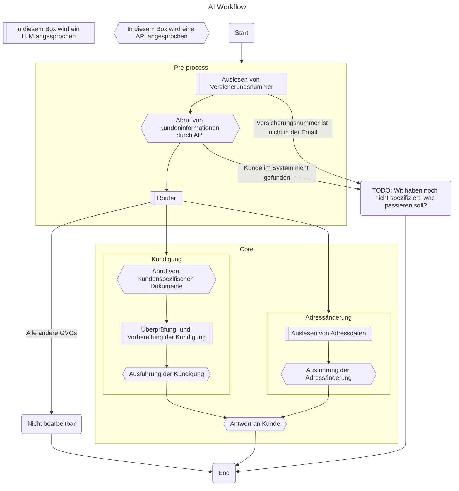

```mermaid {theme: 'neutral', scale: 0.4}
---
title: AI Workflow
---
graph TD
    %% Explanations:
    llm[[In diesem Box wird ein LLM angesprochen]]
    api_call{{In diesem Box wird eine API angesprochen}}

    __START__(Start)
    __START__ --> Pre-process
    subgraph Pre-process
        customer_data_extract[["Auslesen von Versicherungsnummer"]]
        fetch_customer_details{{"Abruf von Kundeninformationen durch API"}}
        router[["Router"]]
        customer_data_extract --> fetch_customer_details
        fetch_customer_details --> router
    end
    router -->|Alle andere GVOs| uncovered
    router --> Kündigung
    router --> Adressänderung
    subgraph Core
        subgraph Kündigung
            fetch_customer_documents{{"Abruf von Kundenspezifischen Dokumente"}}
            termination_execute_prep[["Überprüfung, und Vorbereitung der Kündigung"]]
            termination_execute{{"Ausführung der Kündigung"}}
            fetch_customer_documents --> termination_execute_prep
            termination_execute_prep --> termination_execute
        end
        termination_execute --> answer

        subgraph Adressänderung
            address_data_extract[["Auslesen von Adressdaten"]]
            address_change_execute{{"Ausführung der Adressänderung"}}
            address_data_extract --> address_change_execute
        end
        address_change_execute --> answer

    end
    answer{{"Antwort an Kunde"}}
    todo_node("TODO: Wit haben noch nicht spezifiziert, was passieren soll?")
    fetch_customer_details --> |"Kunde im System nicht gefunden"|todo_node
    customer_data_extract --> |"Versicherungsnummer ist nicht in der Email"|todo_node
    answer --> __END__
    todo_node --> __END__
    __END__(End)
    uncovered("Nicht bearbeitbar") --> __END__;
    classDef default fill: #f2f0ff, line-height: 1.2
    classDef first fill-opacity: 0
    classDef last fill: #bfb6fc
```
