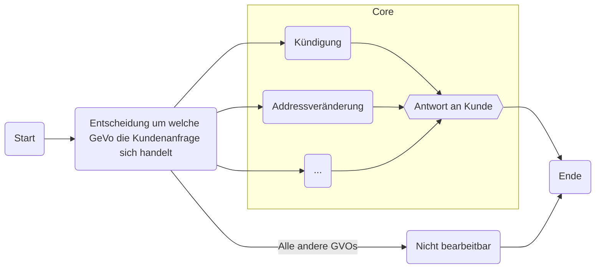
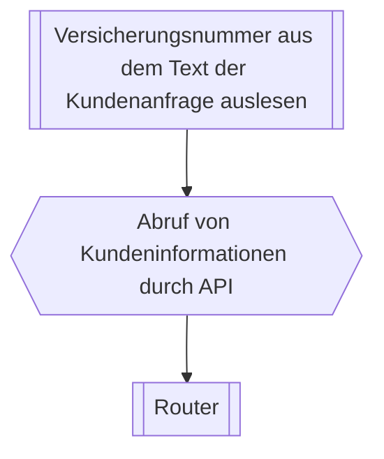
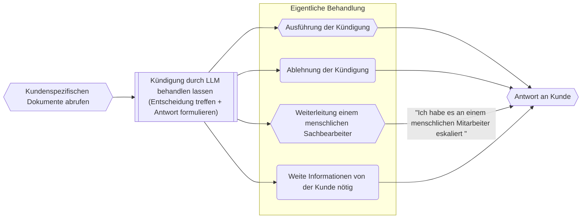
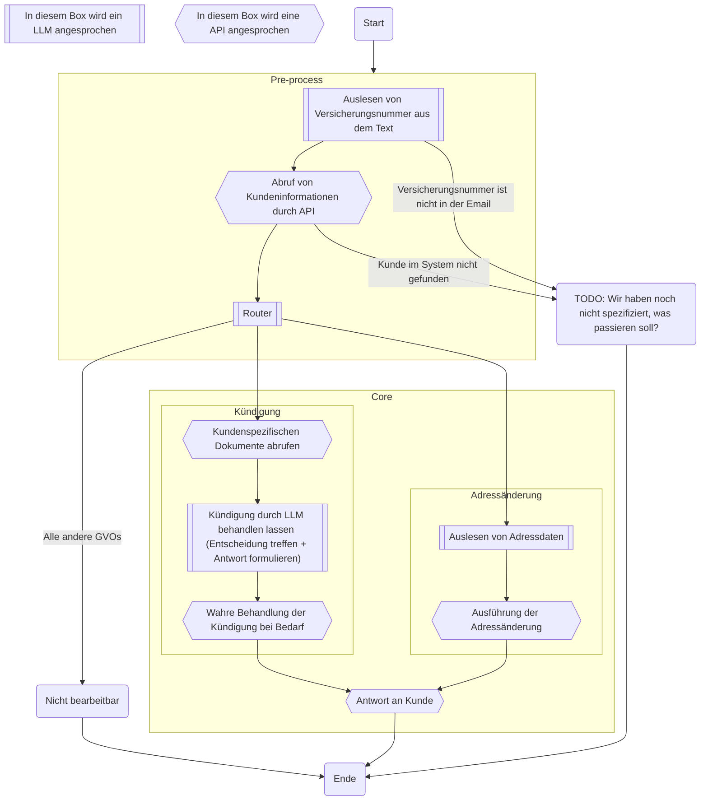
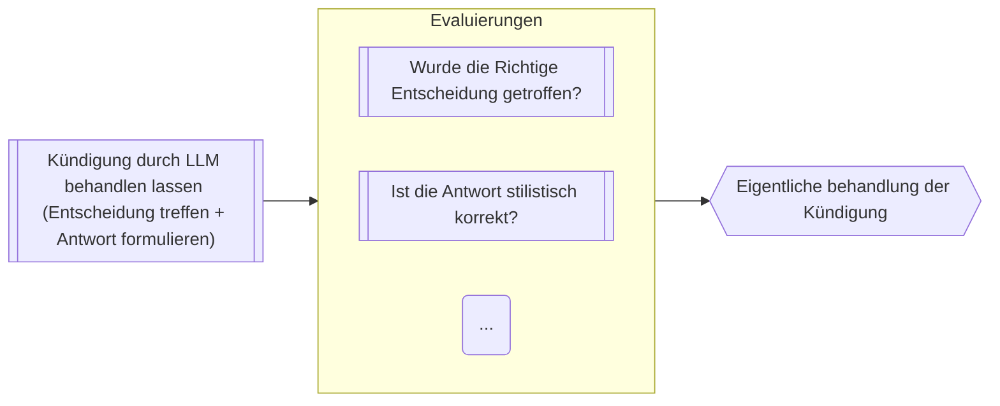
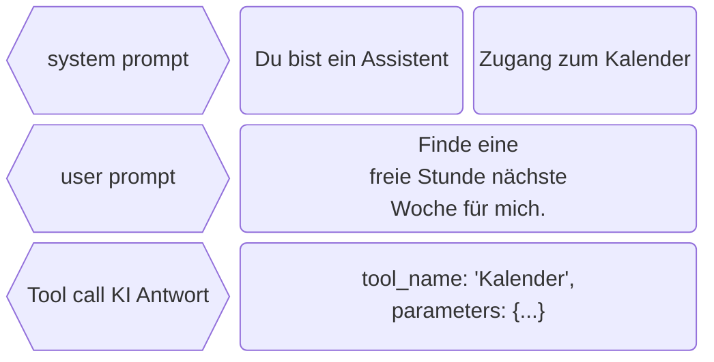
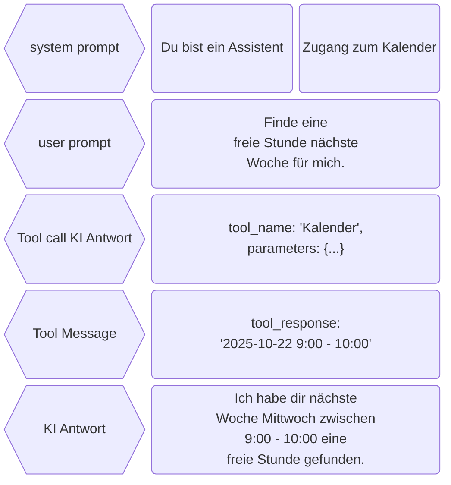
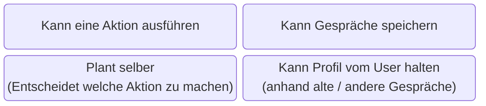
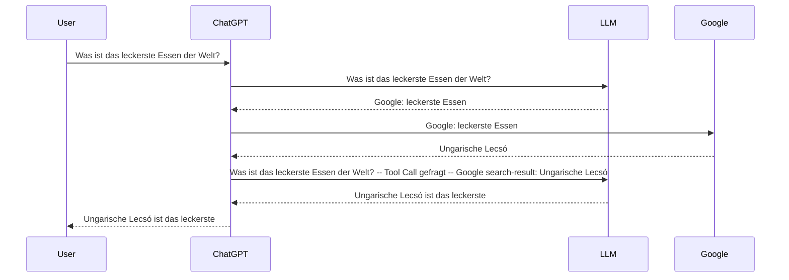
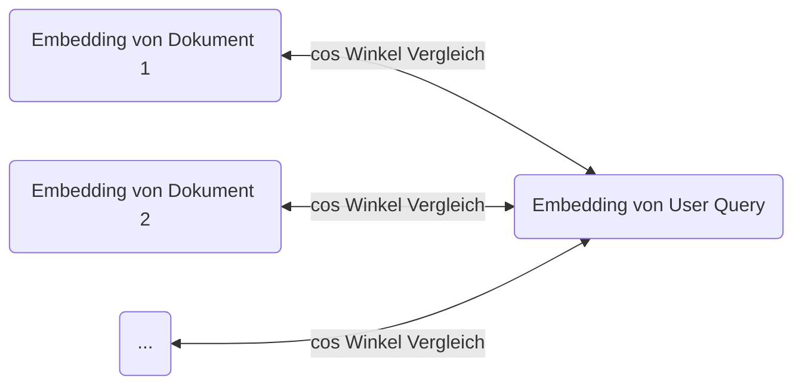

# KI Workflows bei Versicherungen
<script setup>
import { useNav } from '@slidev/client'
import { onMounted } from 'vue'

const nav = useNav()

let previous = {}

onMounted(() => {
  window.addEventListener('keydown', (e) => {
    function onKeyToSlied(key, slide) {
        console.log("noKey")
        if (e.key === key) {
          console.log("pressed" + key )
          let current = nav.currentSlideNo.value
          if (slide == current) {
            nav.go(previous[key])
            previous[key] = undefined
          } else {
            previous[key] = current
            nav.go(slide)
          }
        }
    }
    onKeyToSlied('w', 5)
    onKeyToSlied('e', 10)
  })
})
</script>


--- 

# Ziel dieser Preäsentation

- Einleitung in die Begriffe im KI Umfeld
- Zeigen die KI Lösung, die wir bei FCB zum Markt bringen wollen

---

<div style="height: 100%;">

# Wenn ihr mit dem Handy folgen wollt

## https://fausztbenedek.github.io/fcb-presentation-ki-workflow

</div>

---
layout: center
---

# Wichtige Terminologie


---

<style>
.slidev-page-5 .slidev-layout {
    display: flex;
    flex-flow: column;
}
</style>

# LLM - Large Language Model

<LLMAsAFunction />

---
image: public/chat-gpt-interface.png
layout: image-right
backgroundSize: contain
---

# Prompt

- Prompts sind Eingaben oder Anweisungen, die an ein Large Language Model (LLM) übermittelt werden

---

# System prompt

- Vor unseren Anfragen an ChatGPT versteckt sich eine Beschreibung, die angibt, wie das LLM sich benimmt.

<table>
<tr v-click="2">
<td>System prompt</td>
<td>

```
Du bist ein hilfsbereiter 
Assistent, der immer freundlich 
und vertraut antwortet – so 
locker, als wären alle deine 
besten Freunde.:
```
</td>
<td>

```
Du bist ein hilfsbereiter 
Assistent, der stets so formal 
wie möglich antwortet und immer 
versucht, die Menschen mit 
seinem Professionalismus zu 
beeindrucken.
```
</td>
</tr>
<tr v-click="1">
<td>User prompt</td>
<td>

```
Wohin soll ich meine deutschen 
Kollegen mitnehmen, wenn sie 
mich in Budapest besuchen?
```
</td>
<td>

```
Wohin soll ich meine deutschen 
Kollegen mitnehmen, wenn sie 
mich in Budapest besuchen?
```
</td>
</tr>
<tr v-click="3">
<td>KI Antwort</td>
<td>

```
Super Frage! Nimm sie mit ins 
Ruinencafé Szimpla Kert, es ist 
ein absolutes Must-see in 
Budapest und eine coole Location 
für einen ersten Eindruck!
```
</td>
<td>

```
Ich empfehle eine Führung durch 
das ungarische Parlamentsgebäude, 
gefolgt von einer traditionellen 
ungarischen Mahlzeit in einem 
authentischen Restaurant, wie 
z.B. dem Goulash Disznókö.
```
</td>
</tr>
</table>

---

# Context window (Kontextfenster)

- Die maximale Größe vom Prompt.

<table>
<tr>
    <th><b>LLM</b></th> <th><b>Context window (in tokens)</b></th>
</tr>
<tr>
    <td>Llama 4 Scout</td> <td>10 Millionen</td>
</tr>
<tr>
    <td>GPT 5</td> <td>400 Tausend</td>
</tr>
<tr>
    <td>GPT OSS 20B</td><td>131 Tausend</td>
</tr>
</table>


---

# Temperature

- Je höher, umso wahrscheinlicher ist der LLM die Tokens (Wörter) zu wählen, die nicht höchstwahrscheinlich sind.
    - 0: immer das wahrscheinlichste
    - 1: maximumwert

<br />

# KI Agente und KI Workflows

- Dazu kommen wir noch am Ende

---
layout: center
---

# Was hier bei FCB gebaut wird?

---

# Architektur





---

<style>
.container {
    height: 100%;
    display: grid;
    grid-template-columns: 1fr 1fr;
}
</style>

<div class="container">
<div>

# Pre process

- Um GeVo bearbeiten zu können brauchen wir folgende Informationen:
    - Was ist der Stand im Bestandsystem
    - Möglichst weitere Dokumente
- Und so kommen wir auf folgende Pre process Flow


```text
Sehr geehrte Damen und Herren,

hiermit kündige ich meine Lebensversicherung 
mit der Vertragsnummer LV-123456 zum 31.12.2025.

Mit freundlichen Grüßen

Max Mustermann
```


</div>

<div style="justify-self: center; display: flex; align-items: center;">


</div>
</div>


---

# Router

- Entscheidet zwischen GeVos mithilfe einer LLM
- Promt sieht so aus (Natürlich komplizierter):

```markdown
Welchem GeVo gehört folgende Kundenanfrage?

{Kundenanfrage einfach in dem Prompt kopiert}

Möglichkeiten:
- Addressveränderung
- Kündigung
- Ich kann es noch nicht
```

---

# Kündigung


---

# Addressveränderung

- Es wird gerade daran gearbeitet

---

# Architektur

<style>
/* Hack to make the big mermaid diagram scrollable */
.slidev-layout {
    overflow: scroll;
}
</style>

<div>



</div>

---

<style>
.evaluations-container {
    display: flex;
    flex-flow: column;
    justify-content: space-between;
    height: 100%;
}
</style>

<div class="evaluations-container">
<div>

# Evaluierungen


- = Testen wie das KI leistet

<div v-click="1">

- Bislang haben wir nur für die Kündigung Evaluierungen
</div>
</div>

<div v-click="1">



</div>
</div>

---
layout: two-cols-header
---

# Evaluierungen

(Es gibt menschliche und LLM basierte Evaluierungen)

::left::

## Platz

- Können / Sollen irgendwo im System sein
    - Nach dem Router, um zu evaluieren, ob der Router die Richtige Entscheidung getroffen hat
    - Nach dem die Antwort an der Kunde versendet wurde (= Monitoring)

::right::

## Nützlichkeit

- Hilfe bei Fehlersuche
- Monitoring beim Update

## Nachteile

- Kostet Geld

(Man muss nicht 100% des Verkehrs durch die Evaluierung Pipeline durchführen lassen)


---

<style>
/* Hack to make the big mermaid diagram scrollable */
.slidev-layout {
    overflow: scroll;
}
</style>

# Beispielzeit

<table>
<tr>
<td>
0. Kundenanfrage kommt an
</td>

<td>

```text
Sehr geehrte Damen und Herren,

hiermit kündige ich meine Lebensversicherung 
mit der Vertragsnummer LV-123456 zum 31.12.2025.

Mit freundlichen Grüßen

Max Mustermann
```
</td>
</tr>
<tr>
<td>
1. Auslesen von Versicherungsnummer aus dem Text
</td>

<td>

`LV-123456`
</td>
</tr>
<tr>


<td>

2. Abruf von Kundeninformationen durch API
</td>

<td>

```json
{
    "insurance_number": "LV-123456",
    "customer_inquiry": "Sehr geehrte ...",
    "customer_information:": {
        ...
    }
}
```
</td>

</tr>

<tr>

<td>

3. Router
</td>
<td>

`Kündigung`
</td>
</tr>

<tr>
<td>
4. Dokumentabrufe
</td>
</tr>

<tr>
<td>
    5. Kündigung durch LLM behandlen lassen
</td>
<td>

```
Aktion: Kündigung Durchführen
```
```text
Sehr geehrter Herr Mustermann,

vielen Dank für Ihre Nachricht. Wir bestätigen hiermit die Kündigung Ihrer 
Lebensversicherung mit der Vertragsnummer LV-123456 zum 31.12.2025.

Mit freundlichen Grüßen
Ihr KI Assistent

```
</td>
</tr>


<tr>
<td>
6. Evaluierungen
</td>
<td>

- Richtige Entscheidung: ✅
- Stilistisch: 🚫
</td>
</tr>

</table>

---
layout: center
---

# Expert Terminologie

---

# Tool calling

<table>
<tr>
<td> 



</td>
<td v-click> 




</td>
</tr>
</table>

---

<style>
.agents .mermaid {

    display: flex;
    justify-content: center;
}
</style>

<div class="agents">

# KI Agenten


</div>

---

# ChatGPT searching the web




---

# KI Workflows

- Umgangsprachlich Agente und Workflows sind gleich.
- Welche Aktion ausgeführt wird, entscheidet die App, nicht das LLM.


--- 

<style>
.bracket-column {
  display: inline-block;
  position: relative;
  padding: 1em 2em;
  font-size: 1.2em;
}
.bracket-column::before,
.bracket-column::after {
  content: "";
  position: absolute;
  top: 0;
  bottom: 0;
  width: 10px;
  border: 4px solid currentColor;
}
.bracket-column::before {
  left: 0;
  border-right: none;
  border-radius: 20px 0 0 20px;
}
.bracket-column::after {
  right: 0;
  border-left: none;
  border-radius: 0 20px 20px 0;
}
</style>

# RAG

- Wir wollen Dokumente in dem Prompt inkludieren.

- Problem: Wir haben mehr Information als es in dem Context Window passt.

- Lösung: Lass uns mit Embeddings filtern. (Vektor Datenbank)

---

# So funktionieren Embeddings

<div style="display: flex; justify-content: center; align-items: center; gap: 20px;">

```python
embeddings("Irgendein text")
```

<span> = </span>

<span style="display: flex" class="bracket-column">
    <div style="display: flex; flex-flow: column; align-items: center;">
        <span>3.73303257e-02</span>  
        <span>5.11617884e-02</span> 
        <span>-3.06054106e-04</span>  
        <span>6.02098815e-02</span>
        <span>-1.17494367e-01</span> 
        <span>...</span> 
        <span>384 Zahlen</span> 
    </div>
</span>
</div>

- Sie sollen irgendwie die Bedeuting encodieren.
- Die Vektore die näher sind, sind eher relevant.
- Wir können den cos vom Winkel zwischen zwei Embedding Vektor schnell kalkulieren.


---

# RAG
(Retrieval-augmented generation)

<div style="padding-bottom: 50px;">



</div>

- So können wir das relevanteste Dokument finden
- "A" steht für potentiell den Inhalt von den Dokumenten verändern


---
layout: center
---

# Danke für die Aufmerksamkeit
(Habt ihr Fragen)
