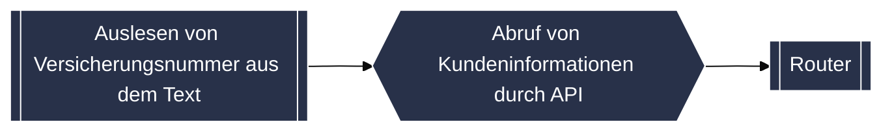
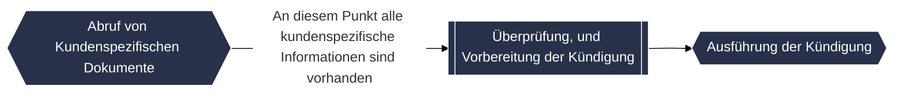

# Mögliche KI Workflows bei Versicherungen
---

# Wichtige Terminologie

- Prompt
- LLM (Large Language Model)
- Embeddings?
- AI Agents?
- Open Source und Open Source LLMs

---

<style>
/* Hack to make the big mermaid diagram scrollable */
.slidev-layout {
    overflow: scroll;
}
/* This part is repeated from the svg itself, because if I copy the svg in here, it breaks otherwise */
.default polygon, .default rect {
  fill: #283149 !important;
  stroke: white !important;
}
.default p {
  color: white !important;
}
.edgeLabel p {
  background-color: #ffffff !important;
}
.cluster rect {
      stroke: black;
      fill: white !important;
    }
</style>

<div>
<Diagram />
</div>

---

# Pre process

- Um GeVo bearbeiten zu können brauchen wir folgende Informationen:
    - Was ist der Stand im Bestandsystem
    - Möglichst weitere Dokumente
- Und so kommen wir auf folgende Pre process Flow



---

# Router

- Entscheidet zwischen GeVos mithilfe einer LLM
- Promt sieht so aus (Natürlich komplizierter):

```markdown
Welchem GeVo gehört volgendem Kundenanfrage?

{Kundenanfrage einfach in dem Prompt kopiert}

Möglichkeiten:
- Addressveränderung
- Kündigung
- Ich kann es noch nicht
```

---

# Kündigung


