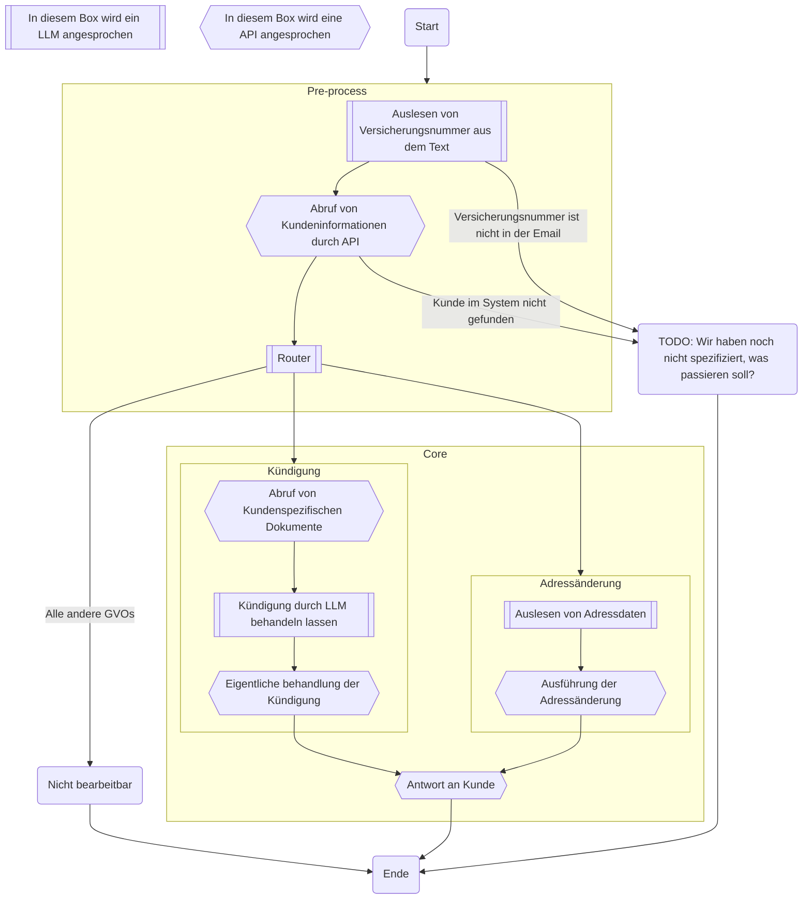
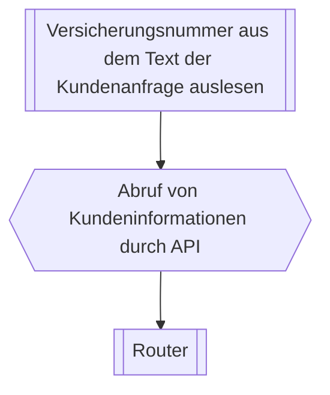
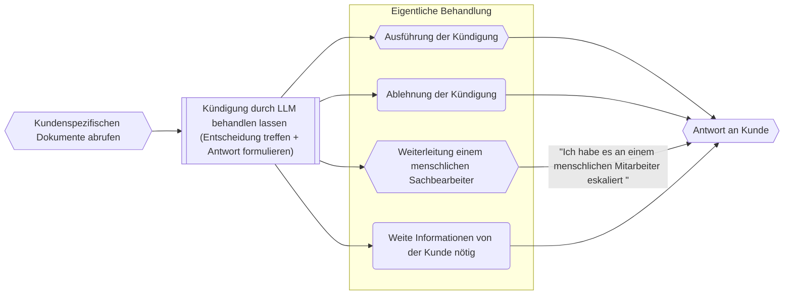
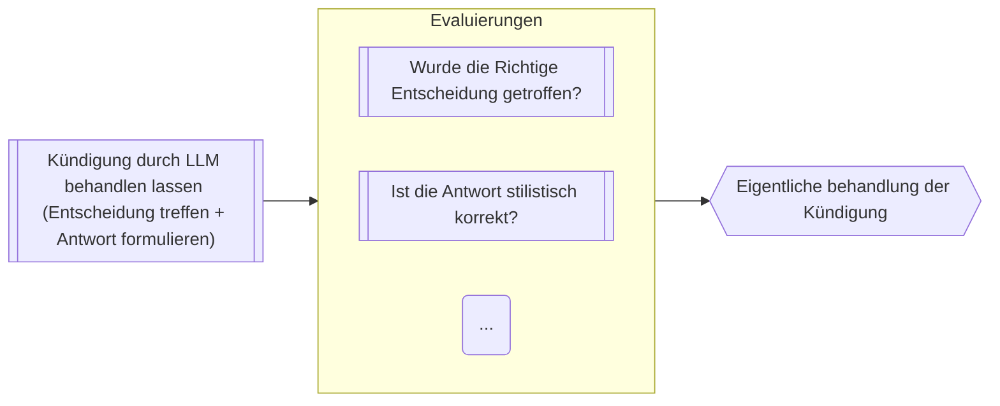

# KI Workflows bei Versicherungen
<script setup>
import { useNav } from '@slidev/client'
import { onMounted } from 'vue'

const nav = useNav()

let previous = undefined

onMounted(() => {
  window.addEventListener('keydown', (e) => {
    // Example: press Shift + S to go to slide 7
    console.log("navigate")
    if (e.key === 'e') {
      let current = nav.currentSlideNo.value
      if (4 == current) {
        nav.go(previous)
        previous = undefined
      } else {
        previous = current
        nav.go(4)
      }
    }
  })
})
</script>


---

<div style="height: 100%;">

# Wenn ihr mit dem Handy folgen wollt

## https://fausztbenedek.github.io/fcb-presentation-ki-workflow

</div>


---

# Wichtige Terminologie

- Prompt
- Context
- LLM (Large Language Model)
- Embeddings?
- AI Agents?
- Open Source und Open Source LLMs

---

# Architektur

<style>
/* Hack to make the big mermaid diagram scrollable */
.slidev-layout {
    overflow: scroll;
}
</style>

<div>



</div>

---

<style>
.container {
    height: 100%;
    display: grid;
    grid-template-columns: 1fr 1fr;
}
</style>

<div class="container">
<div>

# Pre process

- Um GeVo bearbeiten zu können brauchen wir folgende Informationen:
    - Was ist der Stand im Bestandsystem
    - Möglichst weitere Dokumente
- Und so kommen wir auf folgende Pre process Flow
</div>

<div style="justify-self: center; display: flex; align-items: center;">


</div>
</div>


---

# Router

- Entscheidet zwischen GeVos mithilfe einer LLM
- Promt sieht so aus (Natürlich komplizierter):

```markdown
Welchem GeVo gehört volgendem Kundenanfrage?

{Kundenanfrage einfach in dem Prompt kopiert}

Möglichkeiten:
- Addressveränderung
- Kündigung
- Ich kann es noch nicht
```

---

# Kündigung


---

# Addressveränderung

- Es wird gerade daran gearbeitet

---
layout: center
---

# Pheww

---

<style>
.evaluations-container {
    display: flex;
    flex-flow: column;
    justify-content: space-between;
    height: 100%;
}
</style>

<div class="evaluations-container">
<div>

# Evaluierungen


- = Testen wie das KI leistet

<div v-click="1">

- Bislang haben wir nur für die Kündigung Evaluierungen
</div>
</div>

<div v-click="1">



</div>
</div>

---
layout: two-cols-header
---

# Evaluierungen

(Es gibt menschliche und LLM basierte Evaluierungen)

::left::

## Platz

- Können / Sollen irgendwo im System sein
    - Nach dem Router, um zu evaluieren, ob der Router die Richtige Entscheidung getroffen hat
    - Nach dem die Antwort an der Kunde versendet wurde (= Monitoring)

::right::

## Nützlichkeit

- Hilfe bei Fehlersuche
- Monitoring beim Update

## Nachteile

- Kostet Geld

(Man muss nicht 100% des Verkehrs durch die Evaluierung Pipeline durchführen lassen)
