```mermaid

graph LR

    __START__(Start)
    __START__ --> pre_process
    pre_process("Entscheidung, um welche GeVo es sich bei der Kundenanfrage handelt")
    pre_process -->|Alle anderen GeVos| uncovered
    pre_process --> termination
    pre_process --> address_change
    pre_process --> other
    subgraph Core
        termination("Kündigung")
        termination --> answer

        address_change("Adressänderung")
        address_change --> answer

        other("...")
        other --> answer

    end
    answer{{"Antwort an den Kunden"}}
    answer --> __END__
    __END__(Ende)
    uncovered("Nicht bearbeitbar") --> __END__;

```

```mermaid
graph TD
  customer_data_extract[["Versicherungsnummer aus dem Text der Kundenanfrage auslesen"]]
  fetch_customer_details{{"Abruf von Kundeninformationen über API"}}
  router[["Router"]]
  customer_data_extract --> fetch_customer_details
  fetch_customer_details --> router
```

# KI-Workflows bei Versicherungen
<script setup>
import { useNav } from '@slidev/client'
import { onMounted } from 'vue'

const nav = useNav()

let previous = {}

onMounted(() => {
  window.addEventListener('keydown', (e) => {
    function onKeyToSlied(key, slide) {
        console.log("noKey")
        if (e.key === key) {
          console.log("pressed" + key )
          let current = nav.currentSlideNo.value
          if (slide == current) {
            nav.go(previous[key])
            previous[key] = undefined
          } else {
            previous[key] = current
            nav.go(slide)
          }
        }
    }
    onKeyToSlied('a', 12)
    onKeyToSlied('e', 18)
  })
})
</script>
--- 

# Ziel dieser Präsentation

- Mehr Einblick ins KI-Umfeld
- Vorstellung der KI-Lösung, die wir bei FCB auf den Markt bringen wollen

---

<div style="height: 100%;">

# Wenn ihr mit dem Handy folgen wollt

## https://fausztbenedek.github.io/fcb-presentation-ki-workflow

</div>

---
layout: center
---

# Wichtige Terminologie


---

<style>
.slidev-page-5 .slidev-layout {
    display: flex;
    flex-flow: column;
}
</style>

# LLM - Large Language Model

<LLMAsAFunction />


---

<style>
.youtube {
width: 100%;
height: 100%;

}
</style>

<Youtube id="LPZh9BOjkQs" />

---
image: public/chat-gpt-interface.png
layout: image-right
backgroundSize: contain
---

# Prompt

- Prompts sind Eingaben oder Anweisungen, die an ein Large Language Model (LLM) übermittelt werden.

---

# System Prompt

- Hinter unseren Anfragen an ChatGPT verbirgt sich eine Beschreibung, die festlegt, wie sich das LLM verhalten soll.

<table>
<tbody>
<tr v-click="2">
<td>System prompt</td>
<td>

```
Du bist ein hilfsbereiter Assistent, der immer 
freundlich und vertraut antwortet – so locker, 
als wären alle deine besten Freunde.
```
</td>
<td>

```
Du bist ein hilfsbereiter Assistent, der stets 
so formal wie möglich antwortet und immer 
versucht, die Menschen mit seinem 
Professionalismus zu beeindrucken.
```
</td>
</tr>
<tr v-click="1">
<td>User Prompt</td>
<td>

```
Wohin soll ich meine deutschen Kollegen 
mitnehmen, wenn sie mich in Budapest besuchen?
```
</td>
<td>

```
Wohin soll ich meine deutschen Kollegen 
mitnehmen, wenn sie mich in Budapest besuchen?
```
</td>
</tr>
<tr v-click="3">
<td>KI Antwort</td>
<td>

```
Super Frage! Nimm sie mit ins Ruinencafé 
Szimpla Kert, es ist ein absolutes Must-see in 
Budapest und eine coole Location für einen 
ersten Eindruck!
```
</td>
<td>

```
Ich empfehle eine Führung durch das ungarische 
Parlamentsgebäude, gefolgt von einer 
traditionellen ungarischen Mahlzeit in einem 
authentischen Restaurant, wie z.B. dem Goulash 
Disznókö.
```
</td>
</tr>
</tbody>
</table>

---

# Context Window (Kontextfenster)

- Die maximale Größe des Prompts.

<table>
<tbody>
<tr>
    <th><b>LLM</b></th> <th><b>Context Window (in Tokens)</b></th>
</tr>
<tr>
    <td>Llama 4 Scout</td> <td>10 Millionen</td>
</tr>
<tr>
    <td>GPT 5</td> <td>400 000</td>
</tr>
<tr>
    <td>GPT OSS 20B</td><td>131 000</td>
</tr>
<tr>
    <td>GPT-3.5</td><td>4 096</td><td>Damit hat OpenAI den AI-Boom gestartet</td>
</tr>
</tbody>
</table>

---

# Temperature

- Je höher der Wert, desto wahrscheinlicher ist es, dass das LLM Tokens (Wörter) wählt, die nicht am wahrscheinlichsten sind.
    - 0: immer das wahrscheinlichste
    - 1: Maximumwert

<br />

# KI-Agenten und KI-Workflows

- Dazu kommen wir noch am Ende.

---
layout: center
---

# Was wird hier, bei FCB gebaut?

---

# Architektur




---

<style>
.explanation .mermaid {
    padding-top: 90px;
    padding-left: 300px;
}
</style>

# Konvention bei meinen Diagrammen

<div class="explanation">


</div>

---

<style>
.container {
    height: 100%;
    display: grid;
    grid-template-columns: 1fr 1fr;
}
</style>

<div class="container">
<div>

# Pre-Process

- Um eine GeVo bearbeiten zu können, brauchen wir folgende Informationen:
    - Was ist der Stand im Bestandsystem?
    - Möglicherweise weitere Dokumente
- Daraus ergibt sich folgender Pre-Process-Flow


```text
Sehr geehrte Damen und Herren,

hiermit kündige ich meine Lebensversicherung 
mit der Vertragsnummer LV-123456 zum 31.12.2025.

Mit freundlichen Grüßen

Max Mustermann
```


</div>

<div style="justify-self: center; display: flex; align-items: center;">


</div>
</div>

---

# Router

- Entscheidet mithilfe eines LLMs zwischen den GeVos.
- Prompt sieht so aus (in Wirklichkeit natürlich komplexer):

```markdown
Welcher GeVo entspricht der folgenden Kundenanfrage?

{Kundenanfrage wird hier in den Prompt eingefügt}

Möglichkeiten:
- Adressänderung
- Kündigung
- Ich kann es nicht bestimmen
```

---

# Kündigung

```mermaid
graph LR
fetch_customer_documents{{"Kundenspezifische Dokumente abrufen"}}
termination_handled_by_llm[["Kündigung durch LLM behandeln lassen (Entscheidung treffen + Antwort formulieren)"]]
fetch_customer_documents --> termination_handled_by_llm
termination_handled_by_llm --> termination_execute
termination_handled_by_llm --> termination_escalate_to_human
termination_handled_by_llm --> termination_deny
termination_handled_by_llm --> ask_for_more_information
subgraph "Eigentliche Behandlung"
    termination_execute{{"Ausführung der Kündigung"}}
    termination_escalate_to_human{{"Weiterleitung an einen menschlichen Sachbearbeiter"}}
    termination_deny("Ablehnung der Kündigung")
    ask_for_more_information("Weitere Informationen vom Kunden erforderlich")
end 
answer{{Antwort an den Kunden}}
termination_execute --> answer
termination_deny --> answer
termination_escalate_to_human --> |#quot;Ich habe es an einen menschlichen Mitarbeiter eskaliert.#quot;|answer
ask_for_more_information --> answer
```


---

# Adressänderung

- Wird derzeit entwickelt.

---

# Architektur

<style>
/* Hack to make the big mermaid diagram scrollable */
.slidev-layout {
    overflow: scroll;
}
</style>

<div>

```mermaid

graph TD

    __START__(Start)
    __START__ --> Pre-process
    subgraph Pre-process
        customer_data_extract[["Auslesen der Versicherungsnummer aus dem Text"]]
        fetch_customer_details{{"Abruf von Kundeninformationen über API"}}
        router[["Router"]]
        customer_data_extract --> fetch_customer_details
        fetch_customer_details --> router
    end
    router -->|Alle anderen GeVos| uncovered
    router --> fetch_customer_documents
    router --> address_data_extract
    subgraph Core
        subgraph Kündigung
            fetch_customer_documents{{"Kundenspezifische Dokumente abrufen"}}
            termination_handled_by_llm[["Kündigung durch LLM behandeln lassen (Entscheidung treffen + Antwort formulieren)"]]
            fetch_customer_documents --> termination_handled_by_llm
            termination_handled_by_llm --> termination_actual_handling
            termination_actual_handling{{"Tatsächliche Durchführung der Kündigung bei Bedarf"}}
        end

        subgraph Adressänderung
            address_data_extract[["Auslesen von Adressdaten"]]
            address_change_execute{{"Ausführung der Adressänderung"}}
            address_data_extract --> address_change_execute
        end
        termination_actual_handling --> answer
        address_change_execute --> answer
        answer{{Antwort an den Kunden}}

    end
    answer{{"Antwort an den Kunden"}}
    todo_node("TODO: Wir haben noch nicht spezifiziert, was passieren soll")
    fetch_customer_details --> |"Kunde im System nicht gefunden"|todo_node
    customer_data_extract --> |"Versicherungsnummer nicht in der E-Mail gefunden"|todo_node
    answer --> __END__
    todo_node --> __END__
    __END__(Ende)
    uncovered("Nicht bearbeitbar") --> __END__;

```

</div>

---

<style>
.evaluations-container {
    display: flex;
    flex-flow: column;
    justify-content: space-between;
    height: 100%;
}
</style>

<div class="evaluations-container">
<div>

# Evaluierungen


- = Testen, wie gut die KI funktioniert

<div v-click="1">

- Bisher haben wir nur für die Kündigung Evaluierungen.
</div>
</div>

<div v-click="1">


</div>
</div>

---
layout: two-cols-header
---

# Evaluierungen

(Es gibt menschliche und LLM-basierte Evaluierungen)

::left::

## Ort im System

- Können bzw. sollen an verschiedenen Stellen im System stattfinden:
    - Nach dem Router, um zu prüfen, ob die richtige Entscheidung getroffen wurde
    - Nachdem die Antwort an den Kunden gesendet wurde (= Monitoring)

::right::

## Vorteile

- Hilfreich bei der Fehlersuche
- Monitoring bei Updates

## Nachteile

- Verursacht Kosten

(Es ist nicht notwendig, 100 % des Datenverkehrs durch die Evaluierungspipeline laufen zu lassen.)


---

<style>
/* Hack to make the big mermaid diagram scrollable */
.slidev-layout {
    overflow: scroll;
}
</style>

# Beispielablauf

<table>
<tbody>
<tr>
<td>
0. Kundenanfrage geht ein
</td>

<td>

```text
Sehr geehrte Damen und Herren,

hiermit kündige ich meine Lebensversicherung 
mit der Vertragsnummer LV-123456 zum 31.12.2025.

Mit freundlichen Grüßen

Max Mustermann
```
</td>
</tr>
<tr>
<td>
1. Auslesen der Versicherungsnummer aus dem Text
</td>

<td>

`LV-123456`
</td>
</tr>
<tr>


<td>

2. Abruf von Kundeninformationen über API
</td>

<td>

```json
{
    "insurance_number": "LV-123456",
    "customer_inquiry": "Sehr geehrte ...",
    "customer_information": {
        ...
    }
}
```
</td>

</tr>

<tr>

<td>

3. Router
</td>
<td>

`Kündigung`
</td>
</tr>

<tr>
<td>
4. Dokumentenabruf
</td>
</tr>

<tr>
<td>
5. Kündigung durch LLM behandeln lassen
</td>
<td>

```
Aktion: Kündigung durchführen
```
```text
Sehr geehrter Herr Mustermann,

vielen Dank für Ihre Nachricht. Wir bestätigen hiermit die Kündigung Ihrer 
Lebensversicherung mit der Vertragsnummer LV-123456 zum 31.12.2025.

Mit freundlichen Grüßen  
Ihr KI-Assistent
```
</td>
</tr>


<tr>
<td>
6. Evaluierungen
</td>
<td>

- Richtige Entscheidung: ✅
- Stilistisch korrekt: 🚫
</td>
</tr>

</tbody>
</table>

---
layout: center
---

# Expertenterminologie

---
layout: two-cols
---

# Tool calling

```mermaid
block
  columns 3
  label_system_prompt{{"System prompt"}}

  system_prompt("Du bist ein Assistent")
  tools("Zugang zum Kalender")

  label_user_prompt{{"User Prompt"}}
  user_prompt("Finde eine\nfreie Stunde nächste\nWoche für mich."):2

  space:3

  label_tool_call_request{{"Tool-Call-KI-Antwort"}}
  tool_call_request("tool_name: 'Kalender',\nparameters: {...}"):2

  user_prompt -- "Antwort vom LLM" --> tool_call_request
```




::right::

<div v-click>


</div>

---

# ChatGPT durchsucht das Web

```mermaid
sequenceDiagram
    participant User
    participant ChatGPT
    participant LLM
    participant Google
    User->>ChatGPT: 1. Was ist das leckerste Essen der Welt?
    ChatGPT->>LLM: 2. Was ist das leckerste Essen der Welt?
    LLM-->>ChatGPT: 3. Google: leckerstes Essen
    ChatGPT->>Google: 4. Google such durch API: leckerstes Essen
    Google-->>ChatGPT: 5. Ungarisches Lecsó
    ChatGPT->>LLM: 6. (2. 3. 5. Mitgeschickt)
    LLM-->>ChatGPT: Ungarisches Lecsó ist das leckerste auf der ganzen Welt
    ChatGPT-->>User: Ungarisches Lecsó ist das leckerste auf der ganzen Welt
```



---

<style>
.agents {
    height: 100%;
    display: flex;
    flex-flow: column;
}
.agents .mermaid {
    flex: 1;
    display: flex;
    justify-content: center;
}
</style>

<div class="agents">

# KI Agenten

```mermaid
block
    columns 2
    a("Kann Aktionen ausführen")
    b("Kann Gespräche speichern")
    c("Plant selbst \n(entscheidet, welche Aktion auszuführen ist)")
    d("Kann ein Profil des Nutzers führen\n(basierend auf früheren Gesprächen)")
```


</div>

---

# KI-Workflows

- Umgangssprachlich werden „Agenten“ und „Workflows“ oft gleichgesetzt.
- Welche Aktion ausgeführt wird, entscheidet jedoch die App – nicht das LLM.


--- 

<style>
.bracket-column {
  display: inline-block;
  position: relative;
  padding: 1em 2em;
  font-size: 1.2em;
}
.bracket-column::before,
.bracket-column::after {
  content: "";
  position: absolute;
  top: 0;
  bottom: 0;
  width: 10px;
  border: 4px solid currentColor;
}
.bracket-column::before {
  left: 0;
  border-right: none;
  border-radius: 20px 0 0 20px;
}
.bracket-column::after {
  right: 0;
  border-left: none;
  border-radius: 0 20px 20px 0;
}
</style>

# RAG

- Wir wollen Dokumente in den Prompt einfügen.
- Problem: Wir haben zu viel Text, er passt nicht ins Context Window.
- Lösung: Wir filtern mit Embeddings (Vektordatenbank).

---

# So funktionieren Embeddings

<div style="display: flex; justify-content: center; align-items: center; gap: 20px;">

```python
embeddings("Irgendein Text")
```

<span> = </span>

<span style="display: flex" class="bracket-column">
    <div style="display: flex; flex-flow: column; align-items: center;">
        <span>3.73303257e-02</span>  
        <span>5.11617884e-02</span> 
        <span>-3.06054106e-04</span>  
        <span>6.02098815e-02</span>
        <span>-1.17494367e-01</span> 
        <span>...</span> 
        <span>384 Zahlen</span> 
    </div>
</span>
</div>

- Sie sollen die Bedeutung des Textes codieren.
- Vektoren, die näher beieinander liegen, sind semantisch ähnlicher.
- Wir können den Kosinuswinkel zwischen zwei Embeddings schnell berechnen.


---

# RAG
(Retrieval-Augmented Generation)


- So können wir das relevanteste Dokument finden.
- „A“ steht für: Der Inhalt der Dokumente kann potenziell verändert werden.


---
layout: center
---

# Danke für die Aufmerksamkeit
(Habt ihr Fragen?)
