# KI Workflows bei Versicherungen
<script setup>
import { useNav } from '@slidev/client'
import { onMounted } from 'vue'

const nav = useNav()

let previous = {}

onMounted(() => {
  window.addEventListener('keydown', (e) => {
    function onKeyToSlied(key, slide) {
        console.log("noKey")
        if (e.key === key) {
          console.log("pressed" + key )
          let current = nav.currentSlideNo.value
          if (slide == current) {
            nav.go(previous[key])
            previous[key] = undefined
          } else {
            previous[key] = current
            nav.go(slide)
          }
        }
    }
    onKeyToSlied('w', 5)
    onKeyToSlied('e', 10)
  })
})
</script>


--- 

# Ziel dieser Preäsentation

- Einleitung in die Begriffe im KI Umfeld
- Zeigen die KI Lösung, die wir bei FCB zum Markt bringen wollen

---

<div style="height: 100%;">

# Wenn ihr mit dem Handy folgen wollt

## https://fausztbenedek.github.io/fcb-presentation-ki-workflow

</div>

---
layout: center
---

# Wichtige Terminologie


---

<style>
.slidev-layout {
    display: flex;
    flex-flow: column;
}
</style>

# LLM - Large Language Model

<LLMAsAFunction />

---
image: public/chat-gpt-interface.png
layout: image-right
backgroundSize: contain
---

# Prompt

- Prompts sind Eingaben oder Anweisungen, die an ein Large Language Model (LLM) übermittelt werden

---

# System prompt

- Vor unseren Anfragen an ChatGPT versteckt sich eine Beschreibung, die angibt, wie das LLM sich benimmt.

<table>
<tr v-click="1">
<td>System prompt</td>
<td>

```
Du bist ein hilfsbereiter 
Assistent, der immer freundlich 
und vertraut antwortet – so 
locker, als wären alle deine 
besten Freunde.:
```
</td>
<td>

```
Du bist ein hilfsbereiter 
Assistent, der stets so formal 
wie möglich antwortet und immer 
versucht, die Menschen mit 
seinem Professionalismus zu 
beeindrucken.
```
</td>
</tr>
<tr>
<td>User prompt</td>
<td>

```
Wohin soll ich meine deutschen 
Kollegen mitnehmen, wenn sie 
mich in Budapest besuchen?
```
</td>
<td>

```
Wohin soll ich meine deutschen 
Kollegen mitnehmen, wenn sie 
mich in Budapest besuchen?
```
</td>
</tr>
<tr v-click="2">
<td>KI Antwort</td>
<td>

```
Super Frage! Nimm sie mit ins 
Ruinencafé Szimpla Kert, es ist 
ein absolutes Must-see in 
Budapest und eine coole Location 
für einen ersten Eindruck!
```
</td>
<td>

```
Ich empfehle eine Führung durch 
das ungarische Parlamentsgebäude, 
gefolgt von einer traditionellen 
ungarischen Mahlzeit in einem 
authentischen Restaurant, wie 
z.B. dem Goulash Disznókö.
```
</td>
</tr>
</table>

---

# Architektur


---

<style>
.container {
    height: 100%;
    display: grid;
    grid-template-columns: 1fr 1fr;
}
</style>

<div class="container">
<div>

# Pre process

- Um GeVo bearbeiten zu können brauchen wir folgende Informationen:
    - Was ist der Stand im Bestandsystem
    - Möglichst weitere Dokumente
- Und so kommen wir auf folgende Pre process Flow


```text
Sehr geehrte Damen und Herren,

hiermit kündige ich meine Lebensversicherung 
mit der Vertragsnummer LV-123456 zum 31.12.2025.

Mit freundlichen Grüßen

Max Mustermann
```


</div>

<div style="justify-self: center; display: flex; align-items: center;">


</div>
</div>


---

# Router

- Entscheidet zwischen GeVos mithilfe einer LLM
- Promt sieht so aus (Natürlich komplizierter):

```markdown
Welchem GeVo gehört folgende Kundenanfrage?

{Kundenanfrage einfach in dem Prompt kopiert}

Möglichkeiten:
- Addressveränderung
- Kündigung
- Ich kann es noch nicht
```

---

# Kündigung

```mermaid
graph LR
fetch_customer_documents{{"Kundenspezifischen Dokumente abrufen"}}
termination_handled_by_llm[["Kündigung durch LLM behandlen lassen (Entscheidung treffen + Antwort formulieren)"]]
fetch_customer_documents --> termination_handled_by_llm
termination_handled_by_llm --> termination_execute
termination_handled_by_llm --> termination_escalate_to_human
termination_handled_by_llm --> termination_deny
termination_handled_by_llm --> ask_for_more_information
subgraph "Eigentliche Behandlung"
    termination_execute{{"Ausführung der Kündigung"}}
    termination_escalate_to_human{{"Weiterleitung einem menschlichen Sachbearbeiter"}}
    termination_deny("Ablehnung der Kündigung")
    ask_for_more_information("Weite Informationen von der Kunde nötig")
end 
answer{{Antwort an Kunde}}
termination_execute --> answer
termination_deny --> answer
termination_escalate_to_human --> |#quot;Ich habe es an einem menschlichen Mitarbeiter eskaliert #quot;|answer
ask_for_more_information --> answer

```


---

# Addressveränderung

- Es wird gerade daran gearbeitet

---

# Architektur

<style>
/* Hack to make the big mermaid diagram scrollable */
.slidev-layout {
    overflow: scroll;
}
</style>

<div>

```mermaid

graph TD
    %% Explanations:
    llm[[In diesem Box wird ein LLM angesprochen]]
    api_call{{In diesem Box wird eine API angesprochen}}

    __START__(Start)
    __START__ --> Pre-process
    subgraph Pre-process
        customer_data_extract[["Auslesen von Versicherungsnummer aus dem Text"]]
        fetch_customer_details{{"Abruf von Kundeninformationen durch API"}}
        router[["Router"]]
        customer_data_extract --> fetch_customer_details
        fetch_customer_details --> router
    end
    router -->|Alle andere GVOs| uncovered
    router --> fetch_customer_documents
    router --> address_data_extract
    subgraph Core
        subgraph Kündigung
            fetch_customer_documents{{"Kundenspezifischen Dokumente abrufen"}}
            termination_handled_by_llm[["Kündigung durch LLM behandlen lassen (Entscheidung treffen + Antwort formulieren)"]]
            fetch_customer_documents --> termination_handled_by_llm
            termination_handled_by_llm --> termination_actual_handling
            termination_actual_handling{{"Wahre Behandlung der Kündigung bei Bedarf"}}
        end

        subgraph Adressänderung
            address_data_extract[["Auslesen von Adressdaten"]]
            address_change_execute{{"Ausführung der Adressänderung"}}
            address_data_extract --> address_change_execute
        end
        termination_actual_handling --> answer
        address_change_execute --> answer
        answer{{Antwort an Kunde}}

    end
    answer{{"Antwort an Kunde"}}
    todo_node("TODO: Wir haben noch nicht spezifiziert, was passieren soll?")
    fetch_customer_details --> |"Kunde im System nicht gefunden"|todo_node
    customer_data_extract --> |"Versicherungsnummer ist nicht in der Email"|todo_node
    answer --> __END__
    todo_node --> __END__
    __END__(Ende)
    uncovered("Nicht bearbeitbar") --> __END__;

```

</div>

---
layout: center
---

# Pheww

---

<style>
.evaluations-container {
    display: flex;
    flex-flow: column;
    justify-content: space-between;
    height: 100%;
}
</style>

<div class="evaluations-container">
<div>

# Evaluierungen


- = Testen wie das KI leistet

<div v-click="1">

- Bislang haben wir nur für die Kündigung Evaluierungen

```mermaid
graph LR

termination_handled_by_llm[["Kündigung durch LLM behandlen lassen (Entscheidung treffen + Antwort formulieren)"]]
termination_handled_by_llm --> Evaluierungen
subgraph Evaluierungen
direction LR
    right_decision[["Wurde die Richtige Entscheidung getroffen?"]]
    answer_conciseness[["Ist die Antwort stilistisch korrekt?"]]
    other("...")
end
termination_handling{{"Eigentliche behandlung der Kündigung"}}
Evaluierungen --> termination_handling
```

</div>
</div>

<div v-click="1">



</div>
</div>

---
layout: two-cols-header
---

# Evaluierungen

(Es gibt menschliche und LLM basierte Evaluierungen)

::left::

## Platz

- Können / Sollen irgendwo im System sein
    - Nach dem Router, um zu evaluieren, ob der Router die Richtige Entscheidung getroffen hat
    - Nach dem die Antwort an der Kunde versendet wurde (= Monitoring)

::right::

## Nützlichkeit

- Hilfe bei Fehlersuche
- Monitoring beim Update

## Nachteile

- Kostet Geld

(Man muss nicht 100% des Verkehrs durch die Evaluierung Pipeline durchführen lassen)


---

<style>
/* Hack to make the big mermaid diagram scrollable */
.slidev-layout {
    overflow: scroll;
}
</style>

# Beispielzeit

<table>

<tr v-click>
<td>
1. Auslesen von Versicherungsnummer aus dem Text
</td>

<td>

```text
Sehr geehrte Damen und Herren,

hiermit kündige ich meine Lebensversicherung 
mit der Vertragsnummer LV-123456 zum 31.12.2025.

Mit freundlichen Grüßen

Max Mustermann
```
</td>
</tr>
<tr v-click>


<td>

2. Abruf von Kundeninformationen durch API
</td>

<td>

```json
{
    "insurance_number": "LV-123456",
    "customer_inquiry": "Sehr geehrte ...",
    "customer_information:": {
        ...
    }
}
```
</td>

</tr>

<tr v-click>

<td>

3. Router
</td>
<td>

`Kündigung`
</td>
</tr>

<tr v-click>
<td>
4. Dokumentabrufe
</td>
</tr>

<tr v-click>
<td>
    5. Kündigung durch LLM behandlen lassen
</td>
<td>

```
Aktion: Kündigung Durchführen
```
```text
Sehr geehrter Herr Mustermann,

vielen Dank für Ihre Nachricht. Wir bestätigen hiermit die Kündigung Ihrer 
Lebensversicherung mit der Vertragsnummer LV-123456 zum 31.12.2025.

Mit freundlichen Grüßen
Ihr KI Assistent

```
</td>
</tr>


<tr v-click>
<td>
6. Evaluierungen
</td>
<td>

- Richtige Entscheidung: ✅
- Stilistisch: 🚫
</td>
</tr>

</table>

